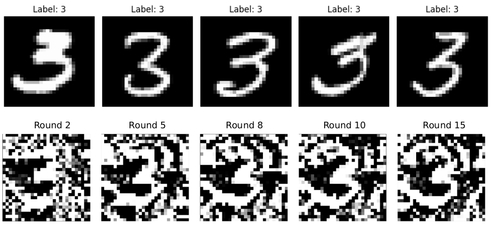
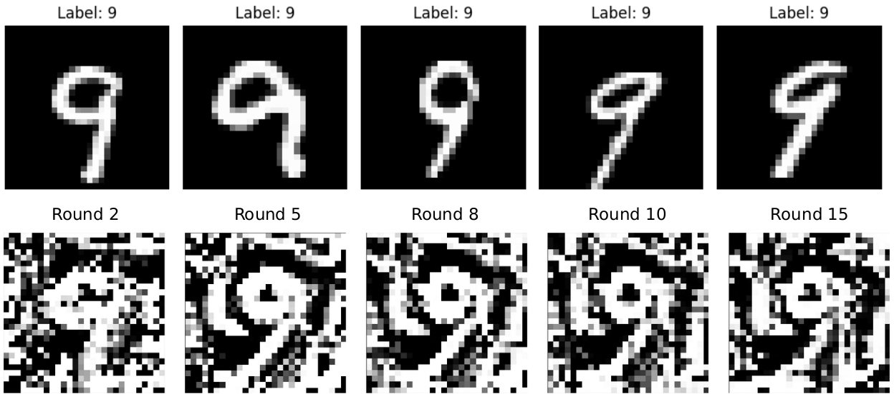

# Implementation of a GAN-based inference attack to a Federated Learning system

The capacity of GAN (_Generative Adversarial Network_) to generate samples that appear to come from the training set without having access to the real dataset, makes it a promising technique for inference attacks in a federated learning environment.

This repo implements a GAN-based inference attack that aims to reconstruct private data samples of a client by model inversion, based on [this paper](https://arxiv.org/pdf/1702.07464). In particular, **this attack shows how federated learning cannot protect the privacy of training sets of honest participants**, exposing them to malicious actors.

To perform the attack, we considered a malicious actor that pretends to be an honest participant in the federated learning process, and another participan that is the victim. The objective of the attacker is to extract information about a specific class of data he does not own by manipulating the federated model and building a GAN locally. To enhance the effectiveness of the attack, the malicious actor will also actively influence the learning process to prompt the victim into releasing further details about the targeted class. The attacker’s behavior involves the use of a Generator network to create fake samples, aiming to make them closely resemble the private data of the victim’s targeted class.

The attack is performed using the MNIST dataset, where the victim’s training dataset includes samples from all classes (digits 0 to 9), whereas the attacker’s dataset contains samples from all classes except one, which remains private to the victim.

The figures show two different tests: one where the client’s private class is digit 3, and another where it is digit 9. The top rows show the training samples private to the victim, while the bottom rows show the evolution of the fake samples generated by the attacker’s GAN over the different rounds.

 